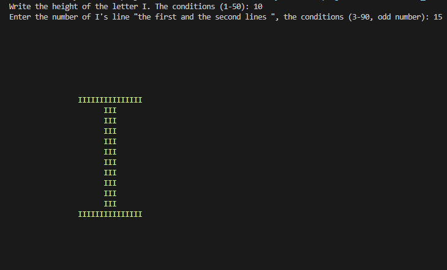

# Letter I Printer

This project generates a stylized representation of the letter 'I' based on user-defined parameters for height and the number of 'I's to print in the first and last lines.

## How It Works

The program prompts the user to input two parameters:

- **Height**: The vertical height of the 'I' (between 1 and 50).
- **Line Count**: The number of 'I's to be printed on the first and last lines (between 3 and 90, odd numbers only).
- Once the inputs are validated, the program prints the 'I' pattern with the specified height and width, using green color for styling example output :



## Project Structure
The code is structured into modular functions to keep the program simple and maintainable:

- **`Print`**: Prints a specified character a given number of times.
- **`PrintNewlines`**: Prints the specified number of newline characters (`\n`).
- **`PrintTabs`**: Prints the specified number of tabs (`\t`).
- **`PrintSpaces`**: Prints a number of space characters.
- **`mainfunction`**: The core function that uses the input parameters to generate the 'I' pattern.

## Algorithm Explanation

- The program ensures the letter 'I' is centered based on the `lineCount` (number of 'I's to print on the first and last lines). Here's how the algorithm works:

#### 1. Centering the 'I's:

- The goal is to center the 'I' character(s) in the middle of the line. The number of spaces on either side of the 'I's determines their centering.

#### 2. Key Lines of Code:

```c
int subtractspace = (lineCount <= 7) ? 0 : 1; // Subtract 1 space if the line count is less than or equal to 7
int numberofspaces = lineCount / 2 - subtractspace; // Calculate the number of spaces to print
```

#### 3. Breakdown:

- So basicly the variable `subtractspace` have [ternaryoperator](https://www.geeksforgeeks.org/conditional-or-ternary-operator-in-c/) will check if the linecount less than or equal 7 if it is the subtract will be 0 if not will be 1 and the `numberofspaces` variable will calculate the number of spaces required to center the 'I's in the line based on the given `lineCount`. but how?
  think it like this :

```txt
we have 5 height and 7 I's so the output:
IIIIIII
   I
   I
   I
   I
   I
IIIIIII

(7/2) -0 = 3
so after 3 spaces print `I`

what if we have 5 height and 9 I's the output will be:
IIIIIIIII
   III
   III
   III
   III
   III
IIIIIIIII

(9/2) - 1 = 3
so after 3 spaces print `III`
```

- If you still don't understand, please reread the explanation.

## Important Note:

The program uses [ANSI ](https://gist.github.com/RabaDabaDoba/145049536f815903c79944599c6f952a) escape codes to set the letter 'I' to green for enhanced visibility, which may not be supported in all terminal environments.
